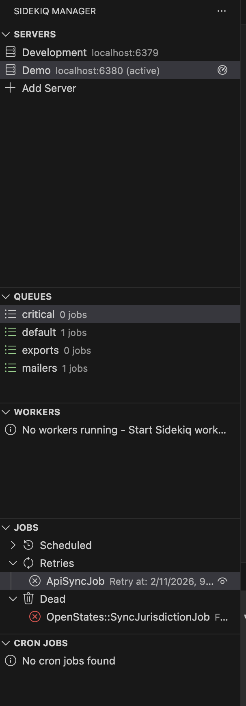
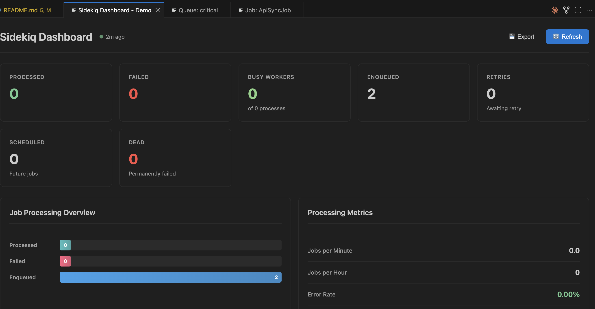
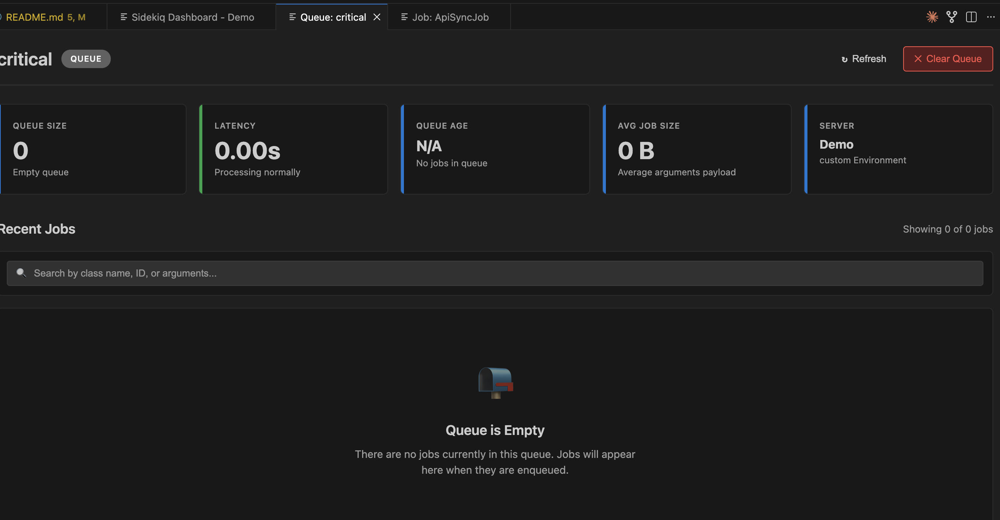
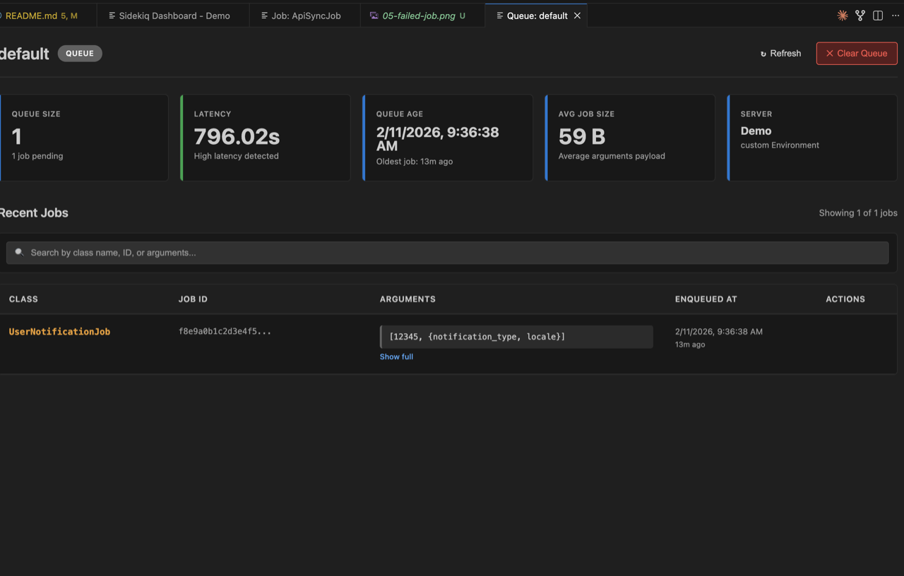

# Sidekiq Manager for VS Code

[](https://marketplace.visualstudio.com/items?itemName=antarrb.sidekiq-manager)
[](https://marketplace.visualstudio.com/items?itemName=antarrb.sidekiq-manager)
[](https://marketplace.visualstudio.com/items?itemName=antarrb.sidekiq-manager)
[](https://github.com/antarr/vs-sidekiq/releases)
[](LICENSE)

> **⚠️ Status: Active Development**
> This extension is in active development. APIs and features may change. Bug reports and contributions welcome!

A comprehensive Visual Studio Code extension for monitoring and managing Sidekiq queues, jobs, and workers directly from your IDE. No more switching to a web browser for Sidekiq administration!

## Features

### 🚀 Multi-Server Support
- Connect to multiple Redis/Sidekiq servers simultaneously
- Quick server switching via status bar
- Environment-based organization (Development, Staging, Production)
- Secure credential storage

### 📊 Real-time Dashboard
- Live metrics and statistics
- Job processing rates
- Queue depths and latencies
- Worker status monitoring
- Failed job tracking

### 💼 Queue Management
- View all active queues
- Clear queues
- Pause/unpause processing
- Move jobs between queues
- Bulk operations support

### 🔧 Job Operations
- Inspect job details and arguments
- Retry failed jobs
- Delete jobs
- Schedule job execution
- View error messages and stack traces

### 👷 Worker Monitoring
- List active workers
- View current job processing
- Worker process information
- Graceful worker termination

## Screenshots

### Sidebar Overview
Monitor your Sidekiq queues, workers, and jobs directly from VS Code's sidebar.



### Real-time Dashboard
View comprehensive metrics and statistics with live updates.



### Queue Management
Inspect queue depths, latency, and manage queue operations.



### Job Details
Examine job arguments, scheduling info, and execution details.



### Failed Job Monitoring
View error messages, stack traces, and retry failed jobs with one click.


## Installation

1. Open VS Code
2. Press `Ctrl+P` / `Cmd+P`
3. Type `ext install sidekiq-manager`
4. Press Enter

## Quick Start

1. **Connect to a Server**
   - Press `Ctrl+Shift+P` / `Cmd+Shift+P`
   - Type "Sidekiq: Connect to Server"
   - Enter your Redis connection details

2. **Open Dashboard**
   - Click the Sidekiq icon in the Activity Bar
   - Or press `Ctrl+Shift+S` / `Cmd+Shift+S`

3. **Switch Between Servers**
   - Click the server name in the status bar
   - Or use `Ctrl+Alt+S` / `Cmd+Alt+S`

## Configuration

```json
{
  "sidekiq.servers": [],
  "sidekiq.refreshInterval": 30,
  "sidekiq.theme": "auto"
}
```

## Commands

- `Sidekiq: Connect to Server` - Add a new server connection
- `Sidekiq: Open Dashboard` - Open the Sidekiq dashboard
- `Sidekiq: Switch Server` - Switch between connected servers
- `Sidekiq: Refresh` - Refresh all views

## Keyboard Shortcuts

- `Ctrl+Shift+S` - Open Sidekiq dashboard
- `Ctrl+Alt+S` - Switch server
- `F5` - Refresh current view
- `Ctrl+1-9` - Quick switch to server 1-9

### Job Operations
- **Select Multiple**: `Ctrl+Click` (add to selection) or `Shift+Click` (range selection)
- `Delete` - Delete selected job(s)
- `Ctrl+R` / `Cmd+R` - Retry selected job(s)
- `Shift+Delete` - Delete all selected jobs
- `Ctrl+Shift+R` / `Cmd+Shift+R` - Retry all selected jobs
- **Right-click** - Show context menu with all available actions

## Requirements

- VS Code 1.74.0 or higher
- Redis server with Sidekiq
- Network access to Redis server

## Support

- 🐛 **Bug Reports**: [GitHub Issues](https://github.com/antarr/vs-sidekiq/issues)
- 💬 **Discussions**: [GitHub Discussions](https://github.com/antarr/vs-sidekiq/discussions)
- 📖 **Documentation**: See this README and inline code comments
- 💼 **Commercial Licensing**: Open a GitHub issue tagged with `commercial-license`

## Contributing

Contributions are welcome! Please read our [Contributing Guide](CONTRIBUTING.md) for details.

## License

This project is licensed under the **Polyform Noncommercial License 1.0.0**.

### Commercial Use

If you want to use this software commercially, please contact the maintainers for a commercial license. We offer flexible licensing for:
- Small businesses and startups
- Individual consultants
- Enterprise organizations

For commercial licensing inquiries, please open an issue on GitHub or contact the maintainers.

See [LICENSE](LICENSE) file for complete terms.

---

Made with ❤️ for the Ruby/Rails community